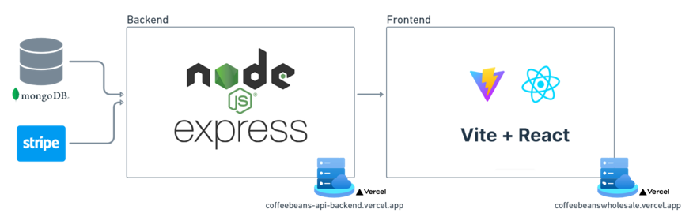

# CSIS 3380 - Fullstack Development - Final Project

Team Members:
- Andrea Olivares (300361840)
- Valentina Alvarez (300360015)
- Luis Miguel Miranda (300363277)

The coffeebeanswholesale backend is like the engine behind a website that helps coffee shops and cafes. It's made to make it easy for them to get good-quality coffee beans. This backend is built using Node.js, which is a popular technology for making web applications. It gives coffee businesses strong tools and features to use.

## Table of Contents

- [Project Description](#project-description)
- [Features](#features)
- [Prerequisites](#prerequisites)
- [Installation](#installation)
- [Usage](#usage)
- [Contributing](#contributing)

## Project Description

The project implements a Node.js backend with Express and MongoDB, aiming to learn backend development principles efficiently.

## Features

- Login (Authentication)
- Admin features
    - User's registration: the admin user is the responsible to create new users (customers)
    - Product's visualization: the admin user can review the whole list of products available and update stock and prices.
    - Inquiries' visualization: the admin user can review the inquiries made by the customers.
    - User's visualization: the admin user can review the whole list of users registered and active/inactive them.
- User features
    - Product catalog: the user can view the product's detail as well as the reviews/ratings.
    - Add products to shopping cart
    - Review shopping cart
    - Remove items from shopping cart
    - Payment (stripe integration)
    - User profile: the user can view his/her profile
    - Add product's reviews/ratings: the user can add a product review based on a purchase order made.

## Prerequisites

- Node.js (version 20.9.0)
- MongoDB (version 7.0.8)

## Installation

1. Clone this repository.
2. Navigate to the project directory.
3. Install dependencies using `npm install`.
4. Configure environment variables.
    - FRONTEND_URL: your frontend URL
    - DB_URL: your MongoDB connection URL
    - STRIPE_API_KEY: your Sripe API Key

## Usage

1. Run the server using `npm start`.
2. Access the API endpoints using tools like Postman or curl.

## Contributing

1. Fork the repository.
2. Create a new branch (`git checkout -b feature/fooBar`).
3. Commit your changes (`git commit -am 'Add some fooBar'`).
4. Push to the branch (`git push origin feature/fooBar`).
5. Create a new Pull Request.
